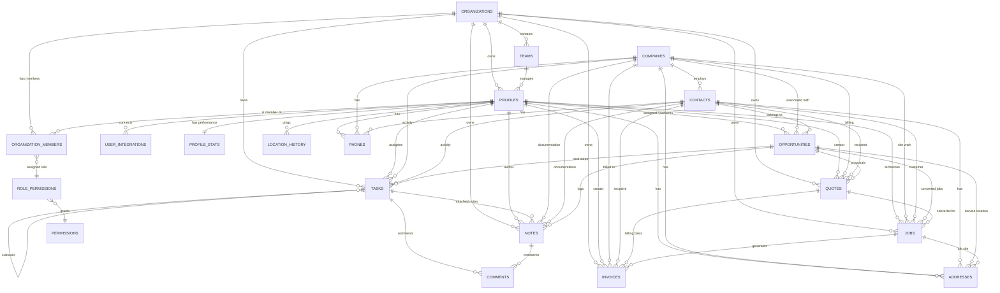

# Supabase Schema & Entity Relationships

> [!IMPORTANT]
> **Data Synchronization Policy**: Every time a new field is added to the application's mockup data or UI, the corresponding table definition in this document **must** be updated. This ensures the Supabase database stays perfectly aligned with the frontend evolution.

This document tracks the database structure, field definitions, and relationships for the CRM. Use the SQL below to initialize or update your Supabase project.

## Tables & Fields

### 1. `profiles`
Represents internal users (Admins, CSRs, Sales, Technicians).
```sql
CREATE TABLE profiles (
  -- ==========================================
  -- IDENTITY & AUTHENTICATION
  -- ==========================================
  id UUID REFERENCES auth.users ON DELETE CASCADE PRIMARY KEY, -- Links to Supabase Auth user
  first_name TEXT NOT NULL,                  -- User's first name
  last_name TEXT NOT NULL,                   -- User's last name
  email TEXT UNIQUE NOT NULL,                -- Primary email address (must be unique)
  avatar_url TEXT,                           -- URL to user's profile picture
  
  -- ==========================================
  -- ROLE & PERMISSIONS
  -- ==========================================
  role TEXT CHECK (role IN ('admin', 'manager', 'sales', 'support', 'marketing', 'technician', 'dispatcher', 'project_manager')), -- User's primary role
  status TEXT DEFAULT 'active' CHECK (status IN ('active', 'inactive', 'pending', 'on_field')), -- Current status
  department TEXT,                           -- Department/team assignment (e.g., 'Sales', 'Support')
  access_level TEXT CHECK (access_level IN ('Full', 'Restricted', 'Limited')), -- System access level
  teams TEXT[],                              -- Array of team names user belongs to (Legacy)
  organization_id UUID REFERENCES organizations(id), -- Current organization membership
  
  -- ==========================================
  -- TERRITORY & HIERARCHY
  -- ==========================================
  territory TEXT,                            -- Geographic territory (e.g., 'West Coast', 'APAC')
  manager_id UUID REFERENCES profiles(id),   -- Direct manager/supervisor
  reports_to TEXT,                           -- Manager's name (denormalized for quick access)
  
  -- ==========================================
  -- SALES & QUOTA (for sales roles)
  -- ==========================================
  monthly_quota NUMERIC(12, 2),              -- Monthly sales quota/target
  quarterly_quota NUMERIC(12, 2),            -- Quarterly sales quota/target
  annual_quota NUMERIC(12, 2),               -- Annual sales quota/target
  commission_rate NUMERIC(5, 2),             -- Commission percentage (e.g., 5.00 for 5%)
  
  -- ==========================================
  -- TECHNICIAN DETAILS (for field service)
  -- ==========================================
  certification TEXT,                        -- Professional certifications (e.g., 'HVAC Master, EPA Certified')
  current_location_name TEXT,                -- Human-readable location (e.g., 'Moving on M1', 'At Depot')
  latitude NUMERIC(10, 8),                   -- Current GPS Latitude (from mobile app)
  longitude NUMERIC(11, 8),                  -- Current GPS Longitude (from mobile app)
  last_location_update TIMESTAMPTZ,          -- Timestamp of last GPS ping
  service_areas TEXT[],                      -- Array of service areas/regions (e.g., ['Brisbane North', 'Gold Coast'])
  
  -- ==========================================
  -- PREFERENCES & SETTINGS
  -- ==========================================
  timezone TEXT DEFAULT 'UTC',               -- User's timezone (e.g., 'America/New_York')
  language TEXT DEFAULT 'en',                -- Preferred language code (e.g., 'en', 'es', 'fr')
  notification_preferences JSONB,            -- JSON object for notification settings
  working_hours JSONB,                       -- JSON object for working schedule (e.g., {"start": "09:00", "end": "17:00"})
  
  -- ==========================================
  -- METADATA & AUDIT
  -- ==========================================
  created_at TIMESTAMPTZ DEFAULT NOW(),      -- Account creation timestamp
  updated_at TIMESTAMPTZ DEFAULT NOW(),      -- Last profile update timestamp
  last_active_at TIMESTAMPTZ,                -- Last login/activity timestamp
  last_login_ip TEXT,                        -- IP address of last login
  deleted_at TIMESTAMPTZ                     -- Soft delete timestamp (NULL if active)
);
-- Note: Phone numbers and addresses are stored in the normalized `phones` and `addresses` tables
```

### 2. `profile_stats`
Performance metrics normalized into a separate table (1:1 with `profiles`). 
Ordered by business flow: **Leads -> Comms -> Tasks -> Sales -> Booking**.
```sql
CREATE TABLE profile_stats (
  profile_id UUID REFERENCES profiles(id) ON DELETE CASCADE PRIMARY KEY,
  
  -- ==========================================
  -- 1. LEAD MANAGEMENT & CONVERSION FUNNEL
  -- ==========================================
  leads_assigned INTEGER DEFAULT 0,          -- Total leads assigned to this user
  leads_contacted INTEGER DEFAULT 0,         -- Leads that received initial contact (call/email/sms)
  leads_qualified INTEGER DEFAULT 0,         -- Leads that passed qualification criteria (budget, authority, need, timeline)
  leads_converted INTEGER DEFAULT 0,         -- Leads successfully converted to opportunities
  leads_lost INTEGER DEFAULT 0,              -- Leads marked as lost, unqualified, or unresponsive
  avg_lead_response_time TEXT,               -- Average time to first response (e.g., '2h 15m')
  
  -- ==========================================
  -- 2. COMMUNICATION - CALLS
  -- ==========================================
  calls_assigned INTEGER DEFAULT 0,          -- Calls scheduled/assigned to user
  calls_dials INTEGER DEFAULT 0,             -- Total outbound call attempts (including no-answer)
  calls_connected INTEGER DEFAULT 0,         -- Calls successfully connected with contact
  calls_voicemails INTEGER DEFAULT 0,        -- Calls that went to voicemail
  calls_lost INTEGER DEFAULT 0,              -- Failed calls (wrong number, blocked, technical issues)
  avg_call_duration TEXT,                    -- Average duration of connected calls (e.g., '4m 30s')
  
  -- ==========================================
  -- 3. COMMUNICATION - EMAILS
  -- ==========================================
  emails_assigned INTEGER DEFAULT 0,         -- Emails assigned to user's queue
  emails_sent INTEGER DEFAULT 0,             -- Emails successfully delivered
  emails_opened INTEGER DEFAULT 0,           -- Emails opened by recipient (tracking enabled)
  emails_clicked INTEGER DEFAULT 0,          -- Emails with link clicks
  emails_replies_received INTEGER DEFAULT 0, -- Emails that received a reply
  emails_conversations INTEGER DEFAULT 0,    -- Email threads with 2+ back-and-forth exchanges
  emails_bounced INTEGER DEFAULT 0,          -- Emails that bounced (hard/soft)
  emails_lost INTEGER DEFAULT 0,             -- Emails marked as spam or undeliverable
  avg_email_response_time TEXT,              -- Average time to respond to incoming emails (e.g., '1h 45m')
  
  -- ==========================================
  -- 4. COMMUNICATION - SMS
  -- ==========================================
  sms_assigned INTEGER DEFAULT 0,            -- SMS messages assigned to user
  sms_sent INTEGER DEFAULT 0,                -- SMS successfully delivered
  sms_received INTEGER DEFAULT 0,            -- SMS replies received from contacts
  sms_conversations INTEGER DEFAULT 0,       -- SMS threads with 2+ exchanges
  sms_lost INTEGER DEFAULT 0,                -- SMS that failed to deliver
  
  -- ==========================================
  -- 5. MEETINGS & APPOINTMENTS
  -- ==========================================
  meetings_scheduled INTEGER DEFAULT 0,      -- Total meetings scheduled
  meetings_completed INTEGER DEFAULT 0,      -- Meetings that took place
  meetings_no_show INTEGER DEFAULT 0,        -- Meetings where contact didn't attend
  meetings_cancelled INTEGER DEFAULT 0,      -- Meetings cancelled by either party
  avg_meeting_duration TEXT,                 -- Average meeting duration (e.g., '45m')
  
  -- ==========================================
  -- 6. PROPOSALS & QUOTES
  -- ==========================================
  proposals_sent INTEGER DEFAULT 0,          -- Proposals/quotes sent to prospects
  proposals_viewed INTEGER DEFAULT 0,        -- Proposals opened/viewed by recipient
  proposals_accepted INTEGER DEFAULT 0,      -- Proposals accepted by customer
  proposals_rejected INTEGER DEFAULT 0,      -- Proposals explicitly rejected
  proposals_expired INTEGER DEFAULT 0,       -- Proposals that expired without response
  avg_proposal_value NUMERIC(12, 2) DEFAULT 0, -- Average value of proposals sent
  
  -- ==========================================
  -- 7. TASKS & FOLLOW-UPS
  -- ==========================================
  tasks_assigned INTEGER DEFAULT 0,          -- Tasks assigned to user
  tasks_in_progress INTEGER DEFAULT 0,       -- Tasks currently being worked on
  tasks_completed INTEGER DEFAULT 0,         -- Tasks marked as complete
  tasks_overdue INTEGER DEFAULT 0,           -- Tasks past their due date
  tasks_lost INTEGER DEFAULT 0,              -- Tasks cancelled or abandoned
  follow_ups_scheduled INTEGER DEFAULT 0,    -- Follow-up tasks created
  follow_ups_completed INTEGER DEFAULT 0,    -- Follow-ups successfully completed
  
  -- ==========================================
  -- 8. SALES & OPPORTUNITIES
  -- ==========================================
  opportunities_assigned INTEGER DEFAULT 0,  -- Opportunities assigned to user
  opportunities_in_progress INTEGER DEFAULT 0, -- Active opportunities being worked
  opportunities_won INTEGER DEFAULT 0,       -- Opportunities closed-won
  opportunities_lost INTEGER DEFAULT 0,      -- Opportunities closed-lost
  pipeline_value NUMERIC(12, 2) DEFAULT 0,   -- Total value of active opportunities
  revenue_generated NUMERIC(12, 2) DEFAULT 0, -- Actual revenue from won deals
  avg_deal_size NUMERIC(12, 2) DEFAULT 0,    -- Average value of won opportunities
  avg_sales_cycle_days INTEGER DEFAULT 0,    -- Average days from opportunity creation to close
  win_rate NUMERIC(5, 2) DEFAULT 0,          -- Win rate percentage (won / (won + lost) * 100)
  
  -- ==========================================
  -- 9. CUSTOMER RELATIONSHIPS
  -- ==========================================
  contacts_created INTEGER DEFAULT 0,        -- New contacts added by user
  contacts_active INTEGER DEFAULT 0,         -- Contacts with activity in last 30 days
  companies_managed INTEGER DEFAULT 0,       -- Companies assigned to user
  customer_meetings INTEGER DEFAULT 0,       -- Meetings with existing customers
  customer_satisfaction_score NUMERIC(3, 2) DEFAULT 0, -- Average CSAT score (1-5)
  nps_score INTEGER DEFAULT 0,               -- Net Promoter Score (-100 to 100)
  
  -- ==========================================
  -- 10. FIELD SERVICE & BOOKING
  -- ==========================================
  jobs_assigned INTEGER DEFAULT 0,           -- Jobs assigned to technician
  jobs_dispatched INTEGER DEFAULT 0,         -- Jobs dispatched (for dispatchers)
  jobs_on_field INTEGER DEFAULT 0,           -- Jobs currently in progress on-site
  jobs_completed INTEGER DEFAULT 0,          -- Jobs successfully completed
  jobs_lost INTEGER DEFAULT 0,               -- Jobs cancelled or failed
  avg_job_rating NUMERIC(2, 1) DEFAULT 0,    -- Average customer rating (1-5)
  avg_job_duration TEXT,                     -- Average time spent on jobs (e.g., '2h 30m')
  
  -- ==========================================
  -- 11. SUPPORT & TICKETS
  -- ==========================================
  tickets_assigned INTEGER DEFAULT 0,        -- Support tickets assigned to agent
  tickets_in_progress INTEGER DEFAULT 0,     -- Tickets currently being worked
  tickets_resolved INTEGER DEFAULT 0,        -- Tickets successfully resolved
  tickets_escalated INTEGER DEFAULT 0,       -- Tickets escalated to higher tier
  tickets_lost INTEGER DEFAULT 0,            -- Tickets closed without resolution
  avg_resolution_time TEXT,                  -- Average time to resolve tickets (e.g., '3h 20m')
  avg_first_response_time TEXT,              -- Average time to first response (e.g., '15m')
  ticket_satisfaction_score NUMERIC(3, 2) DEFAULT 0, -- Average ticket satisfaction (1-5)
  
  -- ==========================================
  -- 12. ACTIVITY & ENGAGEMENT
  -- ==========================================
  activities_logged INTEGER DEFAULT 0,       -- Total activities logged (calls, emails, meetings, notes)
  notes_created INTEGER DEFAULT 0,           -- Notes/comments added to records
  documents_uploaded INTEGER DEFAULT 0,      -- Documents attached to records
  last_activity_date TIMESTAMPTZ,            -- Timestamp of user's last CRM activity
  active_days_count INTEGER DEFAULT 0,       -- Number of days with logged activity (rolling 30 days)
  
  -- ==========================================
  -- AUDIT & METADATA
  -- ==========================================
  updated_at TIMESTAMPTZ DEFAULT NOW()       -- Last update timestamp for this record
);
```

### 3. `companies`
Business accounts/entities.
```sql
CREATE TABLE companies (
  id UUID DEFAULT gen_random_uuid() PRIMARY KEY, -- Unique company identifier
  name TEXT NOT NULL,                    -- Company/business name
  industry TEXT,                         -- Industry sector (e.g., 'Real Estate', 'Construction')
  website TEXT,                          -- Company website URL
  email TEXT,                            -- Primary company email
  location TEXT,                         -- City/region (e.g., 'Brisbane, QLD')
  status TEXT DEFAULT 'prospect' CHECK (status IN ('prospect', 'customer', 'partner', 'inactive')), -- Relationship status
  employee_count TEXT,                   -- Employee range (e.g., '50-100', '500+')
  annual_revenue NUMERIC(15, 2) DEFAULT 0, -- Estimated annual revenue
  created_at TIMESTAMPTZ DEFAULT NOW(),  -- Record creation timestamp
  deleted_at TIMESTAMPTZ                 -- Soft delete timestamp (NULL if active)
);
-- Note: Phone numbers and addresses are stored in the normalized `phones` and `addresses` tables
```

### 4. `contacts`
Individual people (Leads, Customers, Partners).
```sql
CREATE TABLE contacts (
  id UUID DEFAULT gen_random_uuid() PRIMARY KEY, -- Unique contact identifier
  first_name TEXT NOT NULL,              -- Contact's first name
  last_name TEXT NOT NULL,               -- Contact's last name
  email TEXT UNIQUE NOT NULL,            -- Primary email address (must be unique)
  company_id UUID REFERENCES companies(id) ON DELETE SET NULL, -- Associated company
  job_title TEXT,                        -- Job title/role (e.g., 'Project Manager', 'CEO')
  type TEXT DEFAULT 'lead' CHECK (type IN ('lead', 'customer', 'partner')), -- Contact type
  status TEXT DEFAULT 'active',          -- Contact status
  assigned_to UUID REFERENCES profiles(id) ON DELETE SET NULL, -- Assigned sales rep/CSR
  created_at TIMESTAMPTZ DEFAULT NOW(),  -- Record creation timestamp
  deleted_at TIMESTAMPTZ                 -- Soft delete timestamp (NULL if active)
);
-- Note: Phone numbers and addresses are stored in the normalized `phones` and `addresses` tables
```

### 5. `opportunities`
Potential sales and job tracking within the Sales Pipeline.
```sql
CREATE TABLE opportunities (
  id UUID DEFAULT gen_random_uuid() PRIMARY KEY, -- Unique opportunity identifier
  title TEXT NOT NULL,                   -- Opportunity title/description
  contact_id UUID REFERENCES contacts(id) ON DELETE CASCADE, -- Primary contact
  company_id UUID REFERENCES companies(id) ON DELETE CASCADE, -- Associated company
  value NUMERIC(12, 2) DEFAULT 0,        -- Booked/quoted value
  actual_revenue NUMERIC(12, 2) DEFAULT 0, -- Actual revenue (set when completed)
  pipeline TEXT DEFAULT 'incoming' CHECK (pipeline IN ('leads', 'contacted', 'quoting', 'booked', 'completed', 'lost')), -- Sales pipeline stage
  source TEXT DEFAULT 'webform' CHECK (source IN ('webform', 'lead', 'referral')), -- Lead source
  customer_satisfaction TEXT CHECK (customer_satisfaction IN ('happy', 'unhappy')), -- Post-completion satisfaction
  loss_reason TEXT,                      -- Reason for lost opportunity
  scheduled_date TIMESTAMPTZ,            -- Scheduled service/meeting date
  completed_date TIMESTAMPTZ,            -- Completion date
  assigned_to UUID REFERENCES profiles(id) ON DELETE SET NULL, -- Assigned CSR/Sales rep
  technician_id UUID REFERENCES profiles(id) ON DELETE SET NULL, -- Assigned technician/worker
  created_at TIMESTAMPTZ DEFAULT NOW(),  -- Record creation timestamp
  deleted_at TIMESTAMPTZ                 -- Soft delete timestamp (NULL if active)
);
```

### 6. `addresses`
Normalized address storage for Profiles, Companies, Contacts, and Opportunities.
Supports Google Places API integration for autocomplete and geocoding.
```sql
CREATE TABLE addresses (
  id UUID DEFAULT gen_random_uuid() PRIMARY KEY, -- Unique address identifier
  parent_id UUID NOT NULL,               -- References profiles.id, companies.id, contacts.id, or opportunities.id
  parent_type TEXT NOT NULL CHECK (parent_type IN ('profile', 'company', 'contact', 'opportunity')), -- Entity type
  label TEXT DEFAULT 'main',             -- Address label (e.g., 'service_location', 'billing', 'shipping', 'home', 'work')
  
  -- Google Places / Geocoding Data
  place_id TEXT,                         -- Google Places Unique ID (for syncing/recurring lookups)
  formatted_address TEXT,                -- The full human-readable address from Google
  latitude NUMERIC(10, 8),               -- GPS Latitude for map markers
  longitude NUMERIC(11, 8),              -- GPS Longitude for map markers
  plus_code TEXT,                        -- Google Plus Code (for areas without traditional addresses)
  
  -- Structural Address Components
  street_address TEXT,                   -- Street address line (e.g., '123 Main St')
  suburb TEXT,                           -- Suburb/neighborhood
  postal_code TEXT,                      -- ZIP/postal code
  city TEXT,                             -- City
  state TEXT,                            -- State/province
  country TEXT DEFAULT 'Australia',      -- Country
  
  -- Metadata
  is_primary BOOLEAN DEFAULT false,      -- Whether this is the primary address (only ONE can be true per parent)
  created_at TIMESTAMPTZ DEFAULT NOW(),  -- Record creation timestamp
  deleted_at TIMESTAMPTZ                 -- Soft delete timestamp (NULL if active)
);

-- Ensure only ONE primary address per entity
CREATE UNIQUE INDEX idx_addresses_primary ON addresses (parent_id, parent_type) WHERE is_primary = true AND deleted_at IS NULL
```

### 7. `phones`
Normalized phone storage for Profiles, Companies, and Contacts.
```sql
CREATE TABLE phones (
  id UUID DEFAULT gen_random_uuid() PRIMARY KEY, -- Unique phone identifier
  parent_id UUID NOT NULL,               -- References profiles.id, companies.id, or contacts.id
  parent_type TEXT NOT NULL CHECK (parent_type IN ('profile', 'company', 'contact')), -- Entity type
  label TEXT DEFAULT 'mobile',           -- Phone label (e.g., 'mobile', 'work', 'home', 'fax')
  number TEXT NOT NULL,                  -- Phone number
  is_primary BOOLEAN DEFAULT false,      -- Whether this is the primary phone (only ONE can be true per parent)
  created_at TIMESTAMPTZ DEFAULT NOW(),  -- Record creation timestamp
  deleted_at TIMESTAMPTZ                 -- Soft delete timestamp (NULL if active)
);

-- Ensure only ONE primary phone per entity
CREATE UNIQUE INDEX idx_phones_primary ON phones (parent_id, parent_type) WHERE is_primary = true AND deleted_at IS NULL
```

### 8. `organizations`
The top-level tenant/account entity. All data in a CRM usually belongs to an organization.
```sql
CREATE TABLE organizations (
  id UUID DEFAULT gen_random_uuid() PRIMARY KEY, -- Unique organization identifier
  name TEXT NOT NULL,                    -- Organization name (e.g., 'Acme Corp')
  slug TEXT UNIQUE NOT NULL,             -- URL-friendly identifier (e.g., 'acme-corp')
  logo_url TEXT,                         -- URL to organization logo
  subscription_tier TEXT DEFAULT 'free', -- 'free', 'pro', 'enterprise'
  created_at TIMESTAMPTZ DEFAULT NOW(),  -- Record creation timestamp
  updated_at TIMESTAMPTZ DEFAULT NOW(),  -- Last update timestamp
  deleted_at TIMESTAMPTZ                 -- Soft delete timestamp
);
```

### 9. `teams`
Groups within an organization for managing permissions and reporting.
```sql
CREATE TABLE teams (
  id UUID DEFAULT gen_random_uuid() PRIMARY KEY, -- Unique team identifier
  organization_id UUID REFERENCES organizations(id) ON DELETE CASCADE, -- Parent organization
  name TEXT NOT NULL,                    -- Team name (e.g., 'North Sales Team')
  description TEXT,                      -- Team purpose/description
  manager_id UUID REFERENCES profiles(id), -- Team leader/manager
  created_at TIMESTAMPTZ DEFAULT NOW(),  -- Record creation timestamp
  deleted_at TIMESTAMPTZ                 -- Soft delete timestamp
);
```

### 10. `user_integrations` (OAuth & Tokens)
Stores security tokens for external services. **Note**: These are stored in a separate table for security isolation.
```sql
CREATE TABLE user_integrations (
  id UUID DEFAULT gen_random_uuid() PRIMARY KEY, -- Unique integration identifier
  profile_id UUID REFERENCES profiles(id) ON DELETE CASCADE, -- Associated user
  provider TEXT NOT NULL,                -- Service provider (e.g., 'google', 'outlook', 'slack')
  provider_user_id TEXT,                 -- User's ID on the external service
  access_token TEXT NOT NULL,            -- OAuth Access Token (encrypted at rest)
  refresh_token TEXT,                    -- OAuth Refresh Token (encrypted at rest)
  expires_at TIMESTAMPTZ,                -- Token expiration timestamp
  scopes TEXT[],                         -- List of authorized permissions
  status TEXT DEFAULT 'active',          -- 'active', 'revoked', 'expired'
  created_at TIMESTAMPTZ DEFAULT NOW(),  -- Record creation timestamp
  updated_at TIMESTAMPTZ DEFAULT NOW()   -- Last update timestamp
);
-- Note: It is critical that tokens are stored separately from general profile data to minimize exposure.
```

### 11. `tasks` (ClickUp-style)
Advanced task management supporting hierarchy and polymorphic linking to any CRM entity.
```sql
CREATE TABLE tasks (
  id UUID DEFAULT gen_random_uuid() PRIMARY KEY,
  organization_id UUID REFERENCES organizations(id) ON DELETE CASCADE, -- Tenancy
  parent_id UUID,                        -- Polymorphic reference (Contact, Company, Opportunity)
  parent_type TEXT CHECK (parent_type IN ('contact', 'company', 'opportunity', 'profile')),
  parent_task_id UUID REFERENCES tasks(id) ON DELETE CASCADE, -- For Subtasks
  
  title TEXT NOT NULL,
  description TEXT,
  status TEXT DEFAULT 'To Do' CHECK (status IN ('Backlog', 'To Do', 'In Progress', 'In Review', 'Blocked', 'Completed', 'Cancelled')),
  priority TEXT DEFAULT 'Normal' CHECK (priority IN ('Low', 'Normal', 'High', 'Urgent')),
  
  due_date TIMESTAMPTZ,
  start_date TIMESTAMPTZ,
  reminder_date TIMESTAMPTZ,
  
  assigned_to UUID REFERENCES profiles(id) ON DELETE SET NULL,
  created_by UUID REFERENCES profiles(id) ON DELETE SET NULL,
  
  tags TEXT[],                           -- For categorization
  checklists JSONB,                      -- Array of { "text": "...", "is_done": boolean }
  
  is_completed BOOLEAN DEFAULT false,
  completed_at TIMESTAMPTZ,
  
  created_at TIMESTAMPTZ DEFAULT NOW(),
  updated_at TIMESTAMPTZ DEFAULT NOW(),
  deleted_at TIMESTAMPTZ
);
```

### 12. `notes`
Rich-text notes and documentation that can be pinned to any entity.
```sql
CREATE TABLE notes (
  id UUID DEFAULT gen_random_uuid() PRIMARY KEY,
  organization_id UUID REFERENCES organizations(id) ON DELETE CASCADE,
  parent_id UUID,                        -- Polymorphic reference
  parent_type TEXT CHECK (parent_type IN ('contact', 'company', 'opportunity', 'profile', 'task')),
  
  title TEXT,
  content TEXT NOT NULL,                 -- Markdown or JSON-based rich text
  
  created_by UUID REFERENCES profiles(id) ON DELETE SET NULL,
  is_pinned BOOLEAN DEFAULT false,
  is_private BOOLEAN DEFAULT false,      -- For personal user notes
  
  tags TEXT[],
  attachments JSONB,                     -- Array of metadata for uploaded files
  
  created_at TIMESTAMPTZ DEFAULT NOW(),
  updated_at TIMESTAMPTZ DEFAULT NOW(),
  deleted_at TIMESTAMPTZ
);
```

### 13. `comments`
Collaboration layer for tasks and notes.
```sql
CREATE TABLE comments (
  id UUID DEFAULT gen_random_uuid() PRIMARY KEY,
  organization_id UUID REFERENCES organizations(id) ON DELETE CASCADE,
  parent_id UUID NOT NULL,               -- References tasks.id or notes.id
  parent_type TEXT NOT NULL CHECK (parent_type IN ('task', 'note')),
  
  content TEXT NOT NULL,
  author_id UUID REFERENCES profiles(id) ON DELETE SET NULL,
  
  mentions UUID[],                       -- Array of profile IDs mentioned
  reactions JSONB,                       -- Object mapping emoji to user arrays
  
  created_at TIMESTAMPTZ DEFAULT NOW(),
  updated_at TIMESTAMPTZ DEFAULT NOW(),
  deleted_at TIMESTAMPTZ
);
```

### 14. `quotes`
Sales proposals and quotes with line items.
```sql
CREATE TABLE quotes (
  id UUID DEFAULT gen_random_uuid() PRIMARY KEY,
  organization_id UUID REFERENCES organizations(id) ON DELETE CASCADE,
  opportunity_id UUID REFERENCES opportunities(id) ON DELETE SET NULL,
  contact_id UUID REFERENCES contacts(id) ON DELETE SET NULL,
  company_id UUID REFERENCES companies(id) ON DELETE SET NULL,
  
  quote_number TEXT NOT NULL,            -- Human-readable ID (e.g., 'QT-1001')
  title TEXT NOT NULL,                   -- Quote description
  status TEXT DEFAULT 'draft' CHECK (status IN ('draft', 'sent', 'accepted', 'rejected', 'expired', 'converted')),
  
  total_amount NUMERIC(12, 2) DEFAULT 0, -- Final calculated total
  tax_amount NUMERIC(12, 2) DEFAULT 0,
  
  valid_until TIMESTAMPTZ,               -- Expiry date
  line_items JSONB,                      -- Array of { "description": "...", "quantity": 1, "unit_price": 100, "total": 100 }
  
  notes TEXT,                            -- Internal or customer notes
  terms TEXT,                            -- Custom T&Cs
  
  created_by UUID REFERENCES profiles(id) ON DELETE SET NULL,
  created_at TIMESTAMPTZ DEFAULT NOW(),
  updated_at TIMESTAMPTZ DEFAULT NOW(),
  deleted_at TIMESTAMPTZ
);
```

### 15. `jobs`
Field service execution and scheduling.
```sql
CREATE TABLE jobs (
  id UUID DEFAULT gen_random_uuid() PRIMARY KEY,
  organization_id UUID REFERENCES organizations(id) ON DELETE CASCADE,
  opportunity_id UUID REFERENCES opportunities(id) ON DELETE SET NULL,
  quote_id UUID REFERENCES quotes(id) ON DELETE SET NULL, -- Link to accepted quote
  contact_id UUID REFERENCES contacts(id) ON DELETE SET NULL,
  company_id UUID REFERENCES companies(id) ON DELETE SET NULL,
  
  job_number TEXT NOT NULL,              -- Human-readable ID (e.g., 'JB-2001')
  status TEXT DEFAULT 'scheduled' CHECK (status IN ('scheduled', 'dispatched', 'on_field', 'completed', 'cancelled')),
  
  scheduled_start TIMESTAMPTZ,           -- Planned start time
  scheduled_end TIMESTAMPTZ,             -- Planned end time
  actual_start TIMESTAMPTZ,              -- Clock-in time
  actual_end TIMESTAMPTZ,                -- Clock-out time
  
  technician_id UUID REFERENCES profiles(id) ON DELETE SET NULL,
  address_id UUID REFERENCES addresses(id) ON DELETE SET NULL, -- Where the work is done
  
  description TEXT,                      -- Work to be performed
  service_notes TEXT,                    -- Field technician notes
  completed_notes TEXT,                  -- Final wrap-up notes
  
  labor_hours NUMERIC(6, 2),             -- Calculated time spent
  material_cost NUMERIC(12, 2) DEFAULT 0,
  total_revenue NUMERIC(12, 2) DEFAULT 0,
  
  is_invoiced BOOLEAN DEFAULT false,
  
  created_at TIMESTAMPTZ DEFAULT NOW(),
  updated_at TIMESTAMPTZ DEFAULT NOW(),
  deleted_at TIMESTAMPTZ
);
```

### 16. `location_history` (Technician Breadcrumbs)
Stores a history of technician GPS pings for auditing, route optimization, and "on-my-way" customer alerts.
```sql
CREATE TABLE location_history (
  id UUID DEFAULT gen_random_uuid() PRIMARY KEY,
  profile_id UUID REFERENCES profiles(id) ON DELETE CASCADE,
  organization_id UUID REFERENCES organizations(id) ON DELETE CASCADE,
  
  latitude NUMERIC(10, 8) NOT NULL,
  longitude NUMERIC(11, 8) NOT NULL,
  accuracy NUMERIC(8, 2),               -- Horizontal accuracy in meters (Crucial for filtering bad data)
  altitude NUMERIC(8, 2),               -- Altitude in meters
  speed NUMERIC(5, 2),                   -- Travel speed in km/h
  heading NUMERIC(5, 2),                 -- Direction in degrees (0-360)
  
  battery_level NUMERIC(3, 0),           -- Device battery percentage (to monitor phone death)
  
  source TEXT DEFAULT 'mobile_app',      -- 'mobile_app', 'vehicle_tracker', 'manual'
  recorded_at TIMESTAMPTZ DEFAULT NOW()  -- Timestamp of the GPS ping
);

-- Optimize for time-series queries (who was where at 2 PM?)
CREATE INDEX idx_location_recorded_at ON location_history (profile_id, recorded_at DESC);
```

### 17. `invoices` (n8n & Accounting Ready)
Billing and payment tracking. Designed for easy sync with external APIs (Xero, QuickBooks, Stripe) via n8n.
```sql
CREATE TABLE invoices (
  id UUID DEFAULT gen_random_uuid() PRIMARY KEY,
  organization_id UUID REFERENCES organizations(id) ON DELETE CASCADE,
  job_id UUID REFERENCES jobs(id) ON DELETE SET NULL,     -- The work being billed
  quote_id UUID REFERENCES quotes(id) ON DELETE SET NULL, -- Reference to the approved quote
  contact_id UUID REFERENCES contacts(id) ON DELETE SET NULL,
  company_id UUID REFERENCES companies(id) ON DELETE SET NULL,
  
  invoice_number TEXT UNIQUE NOT NULL,    -- Human-readable ID (e.g., 'INV-3001')
  title TEXT,                            -- Brief description
  status TEXT DEFAULT 'draft' CHECK (status IN ('draft', 'sent', 'paid', 'partially_paid', 'overdue', 'void')),
  
  -- Financial Data
  subtotal_amount NUMERIC(12, 2) DEFAULT 0,
  tax_amount NUMERIC(12, 2) DEFAULT 0,
  total_amount NUMERIC(12, 2) DEFAULT 0, 
  total_paid NUMERIC(12, 2) DEFAULT 0,
  balance_due NUMERIC(12, 2) DEFAULT 0,
  currency TEXT DEFAULT 'AUD',           -- Currency code
  
  -- Lifecycle Dates
  issue_date DATE DEFAULT CURRENT_DATE,
  due_date DATE,
  paid_at TIMESTAMPTZ,
  
  -- Line Items (Mirroring Quote or Custom)
  line_items JSONB,                      -- Array of { "description": "...", "quantity": n, "rate": n, "total": n }
  
  -- n8n / External Accounting Sync (Xero, QuickBooks, etc.)
  external_provider TEXT,                -- 'Xero', 'QuickBooks', 'FreshBooks'
  external_id TEXT,                      -- The ID in the accounting system
  external_url TEXT,                     -- Link to the invoice in the external system
  sync_status TEXT DEFAULT 'pending' CHECK (sync_status IN ('pending', 'synced', 'failed')),
  last_sync_at TIMESTAMPTZ,
  sync_error_message TEXT,               -- Storing API error details for troubleshooting
  
  created_by UUID REFERENCES profiles(id) ON DELETE SET NULL,
  created_at TIMESTAMPTZ DEFAULT NOW(),
  updated_at TIMESTAMPTZ DEFAULT NOW(),
  deleted_at TIMESTAMPTZ
);
```

### 18. `permissions`
Master list of granular actions allowed in the system.
```sql
CREATE TABLE permissions (
  id UUID DEFAULT gen_random_uuid() PRIMARY KEY,
  name TEXT UNIQUE NOT NULL,             -- Action name (e.g., 'contacts:create', 'invoices:delete')
  description TEXT,                      -- What this permission allows
  category TEXT NOT NULL,                -- Grouping (e.g., 'Sales', 'Admin', 'Accounting')
  created_at TIMESTAMPTZ DEFAULT NOW()
);
```

### 19. `role_permissions`
Maps roles to their specific granular permissions.
```sql
CREATE TABLE role_permissions (
  id UUID DEFAULT gen_random_uuid() PRIMARY KEY,
  role TEXT NOT NULL,                    -- Role name (matching profiles.role or organization_members.role)
  permission_id UUID REFERENCES permissions(id) ON DELETE CASCADE,
  created_at TIMESTAMPTZ DEFAULT NOW(),
  UNIQUE(role, permission_id)            -- Prevent duplicate mapping
);
```

### 20. `organization_members`
Links users to organizations with specific roles for multi-tenant access.
```sql
CREATE TABLE organization_members (
  id UUID DEFAULT gen_random_uuid() PRIMARY KEY,
  organization_id UUID REFERENCES organizations(id) ON DELETE CASCADE,
  profile_id UUID REFERENCES profiles(id) ON DELETE CASCADE,
  role TEXT NOT NULL,                    -- Role within this specific organization
  status TEXT DEFAULT 'active' CHECK (status IN ('active', 'inactive', 'invited')),
  joined_at TIMESTAMPTZ DEFAULT NOW(),
  UNIQUE(organization_id, profile_id)    -- A user can only have one membership per org
);
```

## Relationships (ER Mapping)



1.  **Profiles -> Opportunities**: One profile can be assigned to many opportunities (Sales) or perform many jobs (Technician).
2.  **Companies -> Contacts**: A company typically has multiple contacts.
3.  **Companies -> Opportunities**: An opportunity is usually linked to a business account.
4.  **Contacts -> Opportunities**: Each opportunity must be linked to a primary individual contact.
5.  **Multi-Contact Support**: All entities (Profiles, Companies, Contacts) can have multiple addresses and phone numbers through the normalized `addresses` and `phones` tables.
