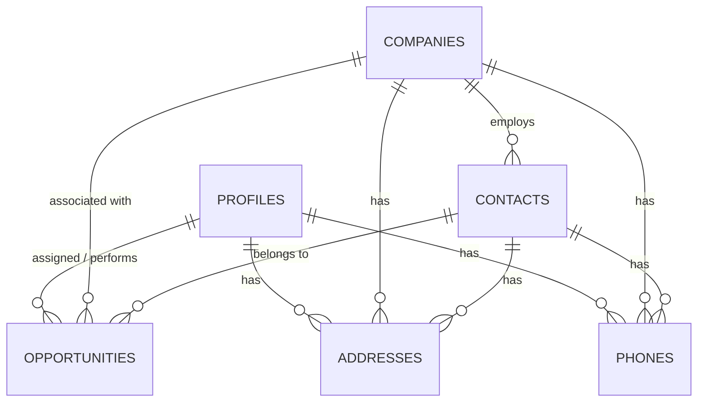

# Supabase Schema & Entity Relationships

> [!IMPORTANT]
> **Data Synchronization Policy**: Every time a new field is added to the application's mockup data or UI, the corresponding table definition in this document **must** be updated. This ensures the Supabase database stays perfectly aligned with the frontend evolution.

This document tracks the database structure, field definitions, and relationships for the CRM. Use the SQL below to initialize or update your Supabase project.

## Tables & Fields

### 1. `profiles`
Represents internal users (Admins, CSRs, Sales, Technicians).
```sql
CREATE TABLE profiles (
  id UUID REFERENCES auth.users ON DELETE CASCADE PRIMARY KEY,
  first_name TEXT NOT NULL,
  last_name TEXT NOT NULL,
  email TEXT UNIQUE NOT NULL,
  role TEXT CHECK (role IN ('admin', 'manager', 'sales', 'support', 'marketing',  'technician', 'dispatcher', 'project_manager')),
  status TEXT DEFAULT 'active',
  department TEXT,
  avatar_url TEXT,
  -- Performance Metrics
  deals_managed INTEGER DEFAULT 0,
  revenue_generated NUMERIC(12, 2) DEFAULT 0,
  tickets_resolved INTEGER DEFAULT 0,
  avg_resolution_time TEXT,
  leads_converted INTEGER DEFAULT 0,
  leads_count INTEGER DEFAULT 0,
  campaigns_managed INTEGER DEFAULT 0,
  jobs_completed INTEGER DEFAULT 0,
  dispatched_count INTEGER DEFAULT 0,
  on_field_count INTEGER DEFAULT 0,
  access_level TEXT,
  teams TEXT[],
  created_at TIMESTAMPTZ DEFAULT NOW(),
  last_active_at TIMESTAMPTZ,
  deleted_at TIMESTAMPTZ
);
```

### 2. `companies`
Business accounts/entities.
```sql
CREATE TABLE companies (
  id UUID DEFAULT gen_random_uuid() PRIMARY KEY,
  name TEXT NOT NULL,
  industry TEXT,
  website TEXT,
  email TEXT,
  phone TEXT,
  mobile TEXT,
  address TEXT,
  location TEXT,
  status TEXT DEFAULT 'prospect' CHECK (status IN ('prospect', 'customer', 'partner', 'inactive')),
  employee_count TEXT,
  annual_revenue NUMERIC(15, 2) DEFAULT 0,
  created_at TIMESTAMPTZ DEFAULT NOW(),
  deleted_at TIMESTAMPTZ
);
```

### 3. `contacts`
Individual people (Leads, Customers, Partners).
```sql
CREATE TABLE contacts (
  id UUID DEFAULT gen_random_uuid() PRIMARY KEY,
  first_name TEXT NOT NULL,
  last_name TEXT NOT NULL,
  email TEXT UNIQUE NOT NULL,
  mobile TEXT,
  phone TEXT,
  company_id UUID REFERENCES companies(id) ON DELETE SET NULL,
  job_title TEXT,
  type TEXT DEFAULT 'lead' CHECK (type IN ('lead', 'customer', 'partner')),
  status TEXT DEFAULT 'active',
  street_address TEXT,
  suburb TEXT,
  postal_code TEXT,
  city TEXT,
  state TEXT,
  assigned_to UUID REFERENCES profiles(id) ON DELETE SET NULL,
  created_at TIMESTAMPTZ DEFAULT NOW(),
  deleted_at TIMESTAMPTZ
);
```

### 4. `opportunities`
Potential sales and job tracking within the Sales Pipeline.
```sql
CREATE TABLE opportunities (
  id UUID DEFAULT gen_random_uuid() PRIMARY KEY,
  title TEXT NOT NULL,
  contact_id UUID REFERENCES contacts(id) ON DELETE CASCADE,
  company_id UUID REFERENCES companies(id) ON DELETE CASCADE,
  value NUMERIC(12, 2) DEFAULT 0, -- Booked/Quoted Value
  actual_revenue NUMERIC(12, 2) DEFAULT 0, -- Set when completed
  pipeline TEXT DEFAULT 'incoming' CHECK (pipeline IN ('leads', 'contacted', 'quoting', 'booked', 'completed', 'lost')),
  source TEXT DEFAULT 'webform' CHECK (source IN ('webform', 'lead', 'referral')),
  customer_satisfaction TEXT CHECK (customer_satisfaction IN ('happy', 'unhappy')),
  loss_reason TEXT,
  scheduled_date TIMESTAMPTZ,
  completed_date TIMESTAMPTZ,
  assigned_to UUID REFERENCES profiles(id) ON DELETE SET NULL, -- CSR/Sales
  technician_id UUID REFERENCES profiles(id) ON DELETE SET NULL, -- Worker
  created_at TIMESTAMPTZ DEFAULT NOW(),
  deleted_at TIMESTAMPTZ
);
```

### 5. `addresses`
Normalized address storage for Profiles, Companies, and Contacts.
```sql
CREATE TABLE addresses (
  id UUID DEFAULT gen_random_uuid() PRIMARY KEY,
  parent_id UUID NOT NULL, -- References profiles.id, companies.id, or contacts.id
  parent_type TEXT NOT NULL CHECK (parent_type IN ('profile', 'company', 'contact')),
  label TEXT DEFAULT 'main', -- 'home', 'work', 'billing', 'shipping'
  street_address TEXT,
  suburb TEXT,
  postal_code TEXT,
  city TEXT,
  state TEXT,
  country TEXT,
  is_primary BOOLEAN DEFAULT true,
  created_at TIMESTAMPTZ DEFAULT NOW(),
  deleted_at TIMESTAMPTZ
);
```

### 6. `phones`
Normalized phone storage for Profiles, Companies, and Contacts.
```sql
CREATE TABLE phones (
  id UUID DEFAULT gen_random_uuid() PRIMARY KEY,
  parent_id UUID NOT NULL,
  parent_type TEXT NOT NULL CHECK (parent_type IN ('profile', 'company', 'contact')),
  label TEXT DEFAULT 'mobile', -- 'mobile', 'work', 'home', 'fax'
  number TEXT NOT NULL,
  is_primary BOOLEAN DEFAULT true,
  created_at TIMESTAMPTZ DEFAULT NOW(),
  deleted_at TIMESTAMPTZ
);
```

## Relationships (ER Mapping)



1.  **Profiles -> Opportunities**: One profile can be assigned to many opportunities (Sales) or perform many jobs (Technician).
2.  **Companies -> Contacts**: A company typically has multiple contacts.
3.  **Companies -> Opportunities**: An opportunity is usually linked to a business account.
4.  **Contacts -> Opportunities**: Each opportunity must be linked to a primary individual contact.
5.  **Multi-Contact Support**: All entities (Profiles, Companies, Contacts) can have multiple addresses and phone numbers through the normalized `addresses` and `phones` tables.
